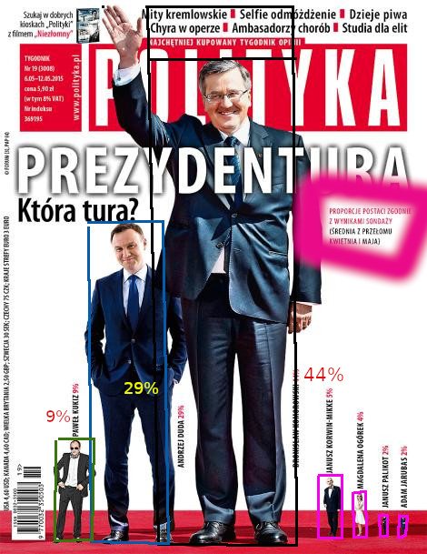

```{r setup, include=FALSE }
knitr::opts_chunk$set(echo = F, warning=F)

library('ggplot2')
library("dplyr")
library("tidyr");
library("tidyverse")
library("RColorBrewer")
library("ggpubr")
library('WDI')
library('openxlsx')
library("countrycode") 
library("knitr")
  
cc <- read.xlsx("https://datacatalogapi.worldbank.org/ddhxext/ResourceDownload?resource_unique_id=DR0090755") |>
    select (country.name=`Economy`, iso3c=`Code`, level=`Income.group`)

mycols <- c( '#e6550d', '#636363', '#31a354', '#e5f5e0', 
             '#3182bd', '#feb24c', '#ffffb3', '#005a32', '#543005')

```

## How to lie with statistics

Less known (now; once bestseller) book by Darrell Huff (142 pages/a5)


https://www.gatesnotes.com/About-Bill-Gates/Summer-Books-2015?WT.mc_id=05_19_2015_SummerBooks_GeekWire

BTW: this photo (taken in 2015) coupled with the fact that Gates funded the
epidemiology research at John Hopkins University has become "evidence"
for various morons (of which the are plenty in the USA),
that Gates was behind the COVID19 pandemic

A book written by Darrell Huff in 1954 presenting an introduction to
statistics for the general reader.
Not a statistician, Huff was a journalist [...]
     
In the 1960/1970s, it became a standard textbook introduction to
the subject of statistics for many college students [...]
one of the best-selling statistics books in history.

https://en.wikipedia.org/wiki/How_to_Lie_with_Statistics

{width=90%}

The book consists of 10 chapters and is written in a provocative,
way (unscientific). Individual chapters are so well known that
if you enter the title of the chapter into google will return
hundreds of thousands references

ch1: The Sample with the Built-in Bias (ie it is very difficult to draw
     unbiased/perfect random sample) 

ch2: The Well-Chosen Average. You can manipulate average value in various ways:
     using various averages/using different definitions of averaged units/measuring
     in various ways

ch3: The Little Figures That Are Not There (Figures = Details)
     Reporting results w/o context or important information in short

ch4: Continuing #ch3 insignificant results = difference is of no practical meaning.

ch5: The Gee-Whiz Graphs (Statistical graphs
     in cartesian coordinates with OY axis not starting from zero)
     https://en.wikipedia.org/wiki/Gee_Whiz →
     https://en.wikipedia.org/wiki/Misleading_graph

ch6: The One-Dimensional Picture  (comparing 1D quantities  using 2D or pseudo-3D)
     https://thejeshgn.com/2017/11/17/how-to-lie-with-graphs/

ch7: The Semiattached Figure.
     Using one thing as a way to claim proof of something else, 
     even though there's no correlation between the two (not attached)
     https://www.secjuice.com/the-semi-attached-figure/

ch8: Post Hoc Rides Again (Correlation is not causation)

ch9: Misinforming people by the use of statistical material 
     might be called statistical manipulation, in a word, **Statisticulation**.
     (summary of ch1--ch8)

ch10: How to Talk Back to a Statistic
     (How not to be deceived)

Who Says So? (interested parties can be unreliable; car seller reputation is poor);
     
How Does He Know? (measurement is often unreliable);
     
What’s Missing? (incomplete analysis signals bias);
     
Many figures lose meaning because a comparison
is missing. In Poland there was a public discussion about falling fertility--
women in Poland do not give birth to children; the average age of a mother at the birth
of her first child is 27 years. [It is a norm in a whole Europe]

Did Somebody Change The Subject? (beware of the Semiattached Figure)
     
Does It Make Sense? (forget about statistics and think about common sense)

Despite its mathematical base, statistics is a much an art as it is a science (Huff p. 120)

### Is it better now?

Unfortunatelly quite opposite...

Misleading statistical analyzes are still doing quite well if not better than in Huff's times,
which is probably due to the following factors:

* the number of statisticians has increased exponentially, often amateurs (everyone
  can count something easily today)

* the amount of readily available data has increased exponentially too

Not only charts can be misleading (intentionally or not),
but this lecture is about charts. Because charts are ubiquitous.
Because statistical charts have become a favorite way for the media, including electronic and social media, to present results (we are inundated with charts that aim to prove something).

## Why Are Statistical Charts Created?

Statistical charts can be created for the following three purposes:

1. **Decorative** (To attract someone's attention; a document without
   images is dull, colorful pictures are better than black-and-white
   ones; fancy drawings are better than simple ones. Form is king;
   content does not matter.)

2. **Explanatory** (To better explain a certain phenomenon to
   someone. It is often said that a picture is worth a thousand
   words.)

3. **Exploratory** (To identify data patterns during the
   exploratory/preliminary stage of data analysis.)

I will focus on the second point, i.e., on **effective graphical methods
for explaining relationships in data**. One graphical method is more
effective than another if the information it contains can be
interpreted more efficiently or easily by the audience [Robbins 2005].


## Types of Charts

Some charts are better than others:

* Recommended charts:

  Strip charts, Bar charts, Line charts, Histograms, Scatter plots,
  Panels (instead of stacked bar charts or multi-line charts)

* Not Recommended:

  Pie charts, Bubble charts, Stacked bar charts, Multi-line charts


{width=90%}

## Historical Corner

Bar charts, line charts, and pie charts were invented by William Playfair (an economist!) in the 18th century.
Dot plots were created by John Cleveland in the 1980s.
Box plots were introduced by John Tukey in the 1970s.


More Playfair's charts one cane find via google or
in [Syamnzik's paper] (http://www.math.usu.edu/symanzik/papers/2009_cost/editorial.html)

Florence Nightingale also worked with statistics. The chart below is called the Nightingale Rose. It is a type of stacked bar chart, but in a polar coordinate system

{width=80%}

There are twelve sectors (polar bars) — one for each month.

The length of the radius, and thus the area of the sector, depends on the magnitude
of the phenomenon it represents (the number of deaths due to: wounds, diseases, and other causes).

FN diagrams (Nightingale's diagrams) didn't catch on, but not every new idea is instantly brilliant...


## Graphic Metaphors (aka Graphic Features)

**Data visualization** involves encoding relationships between numbers
(quantitative information) using **graphic metaphors** (e.g., geometric
shapes, angles, colors, positions, etc.).

Some metaphors are more effective than others in terms
of clarity and accuracy.

According to William S. Cleveland (known for stripcharts) and Robert
McGill in their seminal paper Graphical Perception: Theory,
Experimentation, and Application to the Development of Graphical
Methods (JASA, 1984), graphic metaphors can be ranked by effectiveness
as follows: **Position along a common scale**
➔ Position along identical, nonaligned scale
➔ Length
➔ Slope or direction/Angle
➔ Area
➔ Volume (pseudo-3D graphics)
➔ Color (hue, saturation, or black density)

{width=90%}


**Key observations**:

1. Position is the most effective
   Judging distances along a common scale is precise and intuitive for viewers.

2. Angles are less effective
   Humans struggle to compare angles accurately, especially when differences are small.
   Acute angles tend to be underestimated, while obtuse angles (greater than 90°) are overestimated.

3. Area comparisons are imprecise
   Differentiating between objects of similar areas is highly challenging.

4. Color has low effectiveness
   While visually appealing, colors (whether hue, saturation, or density) are poor
   for conveying precise quantitative differences.

These findings highlight why simple, position-based visuals like bar
charts and scatter plots outperform complex visuals like pie charts or
bubble charts.


## NUTS and TERYT

The Nomenclature of Territorial Units for Statistics (NUTS)
is a geocode standard for referencing the subdivisions of countries for statistical purposes.
The standard is developed and regulated by the European Union, and thus only covers the member states of the EU in detail (cf [NUTS](https://en.wikipedia.org/wiki/Nomenclature_of_Territorial_Units_for_Statistics))

NUTS *standard* was revised several times (on the average every 4 years :-)), so there is even a page 
at ec.europa.eu domain dedicated to NUTS (short) history (cf 
[NUTS history](https://ec.europa.eu/eurostat/documents/345175/501899/Nuts-history))


NUTS1 (level) -- macroregion, NUTS2 -- state, NUTS3 -- subregion (several counties in case of Poland)

Poland is divided into *7 macroregions*,  *16 states (NUTS2)*, and 72
subregions (NUTS3).

NUTS1 level is only for statistical purposes (but regions are in fact
distinct due to history, economics, natural-conditions, cultural factors etc... )

There is a relevant and interesting page by GUS (Main Statistical Office or Główny Urząd Statystyczny),
but unfortunately in Polish (use google translate :-) in case you are interested or mail me)
(cf [Klasyfikacja NUTS w Polsce](https://stat.gov.pl/statystyka-regionalna/jednostki-terytorialne/klasyfikacja-nuts/klasyfikacja-nuts-w-polsce/) )

{width=90%}

The above map shows 7 macroregions (NUT1) and 16 provinces (NUTS2).
BTW province in Polish is "prowincja" (due to both are from Latin) but actually 
Polish administrative provice is called "województwo", from "wodzić" -- ie commanding (the armed 
troops in this context).  This is an old term/custom from the 14th century, 
where Poland was divided into provinces (every province
ruled by a "wojewoda" ie chief of that province). More can be found
at Wikipedia (cf [Administrative divisions of Poland](https://en.wikipedia.org/wiki/Administrative_divisions_of_Poland))

NUTS3 consists of 380 counties grouped into 72 subregions.

A Polish county (called "powiat") is 2-nd level administrative unit. 

In ancient Poland powiat was called
"starostwo" and the head of a "starostwo was called "starosta". "Stary" means Old, so
"starosta" is an old (and thus wise) person. 
BTW the head of powiat is "starosta" as 600 years ago:-)

{width=80%}

The 3rd level administrative unit is called **gmina** (municipality). 

There are (approximately) 380 counties and 2750 municipalities in Poland. 

As Poland population is 38,5 mln and the area equals 312,7
sq kilometers (120 persons per 1 sqkm) on the average each powiat has 820 sqkm and each municipality
has 113.5 sqkm or approximately 100 thousand persons per "powiat and 14 thousand per "gmina".

**TERYT** is a Polish NUTS (developed some 50 years ago). It is complex system which includes
identification of administrative units. Every unit has (up to) a 7-digit id number: wwppggt
where ww = "województwo" id, pp = "powiat" id, gg = "gmina" id and "t" decodes type-of-municipality
(rural, municipal or mixed). Higher units has trailing zeros for irrelevant part of id, so
14 or 1400000 means the same; as well as 1205 and 1205000. Six numbers is enough to identify
a community (approx 2750 units).

So you are now experts on administrative division of Poland, and we can
go back to statistical charts...


## One Variable

### Categorical Variable: **pie charts** and **bar charts**

**Example 1**: Municipalities in Poland by type (source: Local Data Bank of the Central Statistical Office of Poland/BDL)

**Bar chart**

```{r}
g <- read.csv("gminy-typy.csv", sep = ';', 
              dec = ".",  header=T, na.string="NA") %>%
  select (Nazwa, type=RodzajeGmin, value=Wartosc) 

## P1: wykres słupkowy
p.1 <- g %>% filter (Nazwa == "POLSKA") %>% 
  ggplot(aes(x = reorder(type, value), y=value )) +
  geom_bar(stat="identity", fill='forestgreen') +
  xlab(label="") + 
  ylab(label="Number of municipalities") +
  coord_flip()+
  ggtitle("Municipalities in Poland by type (2021)") +
  theme(plot.title = element_text(hjust = 0.5)) +
  geom_text(aes(label=sprintf ("%i", value)), hjust=1.2, color="black", size=3.0) +
  theme(legend.position="none")
p.1
```

Pie chart


```{r}
## PC.1: wykres kołowy
pc.1 <- g %>% filter (Nazwa == "POLSKA") %>% 
  #arrange(desc(type)) %>%
  #mutate(yy.value = cumsum(value) - 0.5*value) %>%
  # można prościej
  mutate(yy.value = value/sum(value)*100) %>%
  ggplot(aes(x = "", y = value, fill = type)) +
  geom_bar(width = 1, stat = "identity", color = "white") +
  coord_polar("y", start = 0)+
  geom_text(aes(label = value), position = position_stack(vjust=0.5)) +
  scale_fill_manual(values = mycols) +
  ggtitle("Municipalities in Poland by type (2021)") +
  ##labs(caption="Źródło: BDL", fill = "Typ") +
  theme_void()

pc.1
```

If there are few values, a pie chart is fine, but why visualize **just three numbers**?

Example 2: Land Use in Poland as a Percentage of Total Area (source: BDL)

In this example, the variable takes on more values, 
which immediately demonstrates the weaknesses of the pie chart.

https://bdl.stat.gov.pl/bdlarch/metadane/podgrupy/441?back=True
agricultural land | forests | lands under water

**Bar Chart**

```{r}
d <- read.csv("PODZ_2780_CREL_20221218071042.csv", sep = ';', 
              dec = ".",  header=T, na.string="NA") |>
  select (Nazwa, type=Kierunki.wykorzystania.powierzchni, unit=Jednostka.miary,
          value=Wartosc) |>
  mutate ( type = case_when(
    type == "grunty pod wodami" ~ "lands under waters",
    type == "grunty rolne - nieużytki" ~ "waste land",
    type == "lasy" ~  "forests",
    type == "ogółem w ha" ~ "total in ha",
    type == "ogółem w odsetkach (Polska = 100%)" ~ "total in %", 
    type == "pozostała powierzchnia" ~ "other area",
    type == "tereny mieszkaniowe" ~ "residential areas",
    type == "tereny przemysłowe"  ~ "industrial lands",
    type == "tereny rekreacji i wypoczynku" ~ "recreational and rest areas",
    type == "użytki rolne" ~ "agricultural land")
  ) |>
  mutate(value=str_replace(value, ',', '.'),
      value = as.numeric(value)) |>
  filter (! grepl('total', type))

p.1 <- d %>% filter (Nazwa == "POLSKA") %>% 
  ggplot(aes(x = reorder(type, value), y=value )) +
  geom_bar(stat="identity", fill='forestgreen') +
  xlab(label="") + ylab(label="% ") +
  scale_y_continuous(name="?", limits=c(0, 60)) +
  coord_flip()+ ggtitle(sprintf ("Share of land use %s", "PL")) +
  ggtitle("Land Use in Poland (% of total)") +
  theme(plot.title = element_text(hjust = 0.5)) +
  geom_text(aes(label=sprintf ("%.1f", value)), hjust=-.08, color="black", size=3.0) +
  theme(legend.position="none")
p.1
```

Pie chart:

```{r}
pc.1 <- d %>% filter (Nazwa == "POLSKA") %>% 
  arrange(desc(type)) %>%
  mutate(yy.value = value/sum(value)*100) %>%
  ggplot(aes(x = "", y = value, fill = type)) +
  geom_bar(width = 1, stat = "identity", color = "white") +
  coord_polar("y", start = 0)+
  scale_fill_manual(values = mycols) +
  ggtitle("Land Use in Poland (% of total)") +
  geom_text(aes(label = value), position = position_stack(vjust=0.5)) +
  theme_void()

pc.1
```

Example 3:
*Nights spent at tourist accommodation establishments by non residents* (2017);
Noclegi udzielone w roku 2017 wg krajów UE. Source: Eurostat tour_occ_ninat


```{r message=F, echo=F, warning=F, fig.width=10}
# https://www.datanovia.com/en/blog/how-to-create-a-pie-chart-in-r-using-ggplot2/
df <- data.frame( class=c("Spain", "UK", "Italy", "France", "Greece",
    "Austria", "Germany", "Croatia", "Portugal", "Netherlands", "Rest28"),
    n=c(305907462, 213378155, 210658786, 133499991, 89284386, 86044321, 83111219,
        80176804, 48884842, 44169041, 202635615));

sum.eu <-sum(df$n)
df["prop"] <- df$n / sum.eu * 100;
df["txt.prop"] <- sprintf ("%.1f", df$prop);

df <- df %>%
  arrange(desc(class)) %>%
  mutate(ypos = cumsum(prop) - 0.5*prop)

mycols <- brewer.pal(13, "Set3")

pc1 <- ggplot(df, aes(x = "", y = prop, fill = class)) +
  geom_bar(width = 1, stat = "identity", color = "white") +
  coord_polar("y", start = 0)+
  scale_fill_manual(values = mycols) +
  ggtitle("Total nights spent by country") +
  theme_void()

pc2 <- ggplot(df, aes(x = "", y = prop, fill = class)) +
  geom_bar(width = 1, stat = "identity", color = "white") +
  coord_polar("y", start = 0)+
  geom_text(aes(y = ypos, label = txt.prop), color = "black")+
  scale_fill_manual(values = mycols) +
  ggtitle("Total nights spent by country") +
  theme_void()

## dot-plot
pc3 <- ggplot(df, aes(x = reorder(class, n) )) +
  geom_point(aes(y = prop, colour = 'prop' ), size=3) +
  xlab(label="#") + ylab(label="% ") + coord_flip()+
  ggtitle("Total nights spent by country") +
  theme(plot.title = element_text(hjust = 0.5))

## bar chart
pc4 <- ggplot(df, aes(x = reorder(class, n), y=prop)) +
  geom_bar(stat="identity", fill = 'navyblue' ) +
  xlab(label="#") + ylab(label="% ") +
  coord_flip()+ 
  ##labs(caption="Źródło: BDL", fill = "Typ") +
  ggtitle("Total nights spent by country") +
  theme(plot.title = element_text(hjust = 0.5))
```

Pie charts:

```{r  message=F, echo=F, warning=F, fig.width=10}
ggarrange(pc1, pc2, ncol = 2, nrow = 1)
```

Bar charts:

```{r  message=F, echo=F, warning=F, fig.width=10}
ggarrange(pc3, pc4, ncol = 2, nrow = 1)
```

## One Variable cont.

### Quantitative Variable: histogram

A histogram is a graphical representation of the distribution of a dataset. 
It shows how frequently each value (or range of values) occurs within the dataset.


Example: The age of Nobel Prize laureates (up to 2018);
Source: [The Nobel Prize API Developer Hub](https://nobelprize.readme.io/))

```{r, cache = F, dependson = "pl_hotel_data"}
nlf <- read.csv("nobel_laureates3.csv", sep = ';', dec = ",",  header=T, na.string="NA");
noblisci <- nrow(nlf)

ggplot(nlf, aes(x = age)) +
  geom_histogram(bins = nclass.Sturges(nlf$age), fill='forestgreen', color='aquamarine') +
  geom_text(aes(y = 150, x = 20, label = sprintf("n = %i", noblisci) ), color = "black")
```

Histograms with a bin (interval) width of 10, 5, 2 and 1 years:

```{r, cache = F, echo=F, dependson = "pl_hotel_data"}
#library(ggpubr)
p1 <- ggplot(nlf, aes(x = age)) +
  geom_histogram(binwidth = 10, fill='forestgreen')
p2 <- ggplot(nlf, aes(x = age)) +
  geom_histogram(binwidth = 5, fill='forestgreen')
p3 <- ggplot(nlf, aes(x = age)) +
  geom_histogram(binwidth = 2, fill='forestgreen')
p4 <- ggplot(nlf, aes(x = age)) +
  geom_histogram(binwidth = 1, fill='forestgreen')

ggarrange(p1,p2,p3,p4)
```

* The more values/intervals, the more detailed the histogram becomes, which is not 
  necessarily desirable because it can obscure the overall picture. 

* There is no "golden rule" for how many intervals there should be, 
  as their number determines the shape and the optical size (i.e., the total area) of the histogram. 

* The fewer the intervals, the larger the histogram will appear optically.

## Comparison of distributions

### Qualitative variable

*stacked barchart* vs *grouped barchart*

**Gruped bar chart**

```{r}
p.2 <- g %>% filter (Nazwa %in% c("POMORSKIE", "MAZOWIECKIE", "ŚLĄSKIE")) %>%
  ggplot(aes(x = reorder(type, value), y=value, fill=Nazwa, group=Nazwa )) +
  geom_bar(stat="identity",  position="dodge") +
  xlab(label="") + ylab(label="% ") +
  coord_flip()+ 
  ggtitle("Municipalities in selected provinces by type (2021)") +
  theme(plot.title = element_text(hjust = 0.5)) +
  scale_fill_manual(values = mycols) +
  geom_text(aes(
    x = reorder(type, value), y=value, group=Nazwa,
    label=sprintf ("%i", value)), 
    ### https://stackoverflow.com/questions/6017460/position-geom-text-on-dodged-barplot
    position = position_dodge(width = .9),
    hjust=1.2, color="black", size=3.0) +
  labs(fill = "Name: ") +
  theme(legend.position="top")
p.2
```

**Stacked bar chart**

```{r}
p.3 <- g %>% filter (Nazwa %in% c("POMORSKIE", "MAZOWIECKIE", "ŚLĄSKIE")) %>%
  ggplot(aes(x = type, y=value, fill=Nazwa, group=Nazwa )) +
  geom_bar(stat="identity",  position="stack") +
  xlab(label="") + ylab(label="% ") +
  coord_flip()+ 
  ggtitle("Municipalities in selected provinces by type (2021)") +
  theme(plot.title = element_text(hjust = 0.5)) +
  scale_fill_manual(values = mycols) +
  geom_text(aes(
    x = type, y=value, group=Nazwa,
    label=sprintf ("%i", value)), 
    ### https://stackoverflow.com/questions/6017460/position-geom-text-on-dodged-barplot
    position = position_stack(),
    hjust=1.2, color="black", size=3.0) +
  labs(fill = "Name: ") +
  theme(legend.position="top")
p.3
```

or

Comparison of three provinces reveals the limitations of pie charts (with more numbers,
the pie chart becomes unreadable/ineffective).


```{r}
##
## (Multi) Pie chart
## Faceted pie-chart with text
pc.3.x <- g %>% filter (Nazwa %in% c("POMORSKIE", "MAZOWIECKIE", "ŚLĄSKIE")) %>%
  group_by(Nazwa) %>%
  #arrange(desc(type)) %>%
  ##mutate(yy.value = cumsum(value) - 0.5*value) %>%
  ## można prościej:
  mutate(yy.value = value /sum (value) * 100)  %>%
  ungroup() %>%
  ggplot(aes(x = "", y = yy.value, fill = type)) +
  geom_bar(width = 1, stat = "identity") +
  #coord_polar("y", start = 0)+
  geom_text(aes(label = value), color = "black", position = position_stack(vjust=0.5))+
  #scale_fill_manual(values = mycols) +
  ggtitle("Municipalities in selected provinces by type (2021)") +
  theme_void() +
  facet_wrap(~Nazwa)

##pc.3.x
## pie
pc.3 <- pc.3.x + coord_polar("y", start = 0) +
  theme(legend.position = "bottom")
pc.3
```

Land use in selected provinces

```{r}
p.2 <- d %>%
filter (Nazwa %in% c("POMORSKIE", "MAZOWIECKIE", "ŚLĄSKIE")) %>%
  ggplot(aes(x = reorder(type, value), y=value, fill=Nazwa )) +
  geom_bar(stat="identity",  position="dodge") +
  xlab(label="") + ylab(label="% ") +
  coord_flip()+ 
  ggtitle("Land use in selected provinces (%)") +
  theme(plot.title = element_text(hjust = 0.5)) +
  theme(legend.position="top")
  
p.2
```

```{r}
p.3 <- d %>% filter (Nazwa %in% c("POMORSKIE", "MAZOWIECKIE", "ŚLĄSKIE")) %>%
  mutate(type=factor(type, levels=c(
"agricultural land",
"forests",
"lands under waters",
"recreational and rest areas",
"waste land", "other area", "residential areas", "industrial lands"))) |>
  ##ggplot(aes(x = reorder(Nazwa, -value), y=value, fill=type )) +
  ggplot(aes(x = Nazwa, y=value, fill=type )) +
  geom_bar(stat="identity",  position="stack") +
  xlab(label="") + ylab(label="% ") +
  coord_flip()+
  ggtitle("Land use in selected provinces (%)") +
  theme(plot.title = element_text(hjust = 0.5)) +
  theme(legend.position="bottom")

p.3
```

```{r}
pc.3.x <- d %>% filter (Nazwa %in% c("POMORSKIE", "MAZOWIECKIE", "ŚLĄSKIE")) %>%
  group_by(Nazwa) %>%
  mutate(yy.value = value /sum (value) * 100)  %>%
  ungroup() %>%
  ggplot(aes(x = "", y = yy.value, fill = type)) +
  geom_bar(width = 1, stat = "identity") +
  geom_text(aes(label = value), color = "black", position = position_stack(vjust=0.5))+
  ggtitle("Land use in selected provinces  (%)") +
  theme_void() +
  facet_wrap(~Nazwa)

pc.3.x
```

```{r}
## pie
pc.3 <- pc.3.x + coord_polar("y", start = 0) +
  theme(legend.position = "bottom")
pc.3
```

Still insists on using pie charts? 😊

**Another example**

CBOS (leading Polish government-funded research institute focused on public opinion polling)
conducts the survey "Current Problems and Events" at least 12 times a year,
on a representative sample of approximately 1,000 adult residents of Poland.
(cf https://www.cbos.pl/PL/trendy/trendy.php?)

```{r, cache = F, echo=F, message=F, warning=FALSE}
dA <- read.csv("zaufanie_do_politykow_CBOS_2019.csv", sep = ';',  header=T, na.string="NA");

## kto;zaufanie;diffz;nieuf;diffn;obojetnosc;nieznajomosc

## https://stackoverflow.com/questions/17148679/construct-a-manual-legend-for-a-complicated-plot
cols <- c("zaufanie"="blue","nieufnosc"="red","nieznajomosc"="black")

### https://www.guru99.com/r-dplyr-tutorial.html#9
### Ordering factor
dA$sortOrder <- dA$zaufanie

dB <- dA %>% gather(aspekt, vv, zaufanie:nieznajomosc) %>% 
   filter(aspekt=="zaufanie" | aspekt =="nieuf" | aspekt == "nieznajomosc") %>% as.data.frame

## stacked barchart
p2 <- ggplot(dB, aes(x = reorder(kto, sortOrder), y=vv, fill=aspekt )) +
  ggtitle("Zaufanie do polityków 1/2019") +
  theme(legend.position="top") +
  xlab(label="") + 
  ylab(label="") + 
  geom_bar(position="stack", stat="identity") +
  coord_flip()
##p2

## grouped
p2dodge <- ggplot(dB, aes(x = reorder(kto, sortOrder), y=vv, fill=aspekt )) +
  ggtitle("Zaufanie do polityków 1/2019") +
  theme(legend.position="top") +
  xlab(label="") + 
  ylab(label="") + 
  geom_bar(position="dodge", stat="identity") +
  coord_flip()
##p2dodge
 
## Faceted piechar
## http://zevross.com/blog/2019/04/02/easy-multi-panel-plots-in-r-using-facet_wrap-and-facet_grid-from-ggplot2/
p3x <- ggplot(dB, aes(x = "", y=vv, fill=factor(aspekt))) + 
  ggtitle("Zaufanie do polityków 1/2019") +
   theme(legend.position="top") +
  xlab(label="") + 
  ylab(label="") + 
  facet_wrap(~kto, ncol=8) + 
  geom_bar(width = 1,position = "fill", stat="identity") + 
  coord_polar(theta="y")
##p3x

## Faceted barchart
p3A <- ggplot(dB, aes(x =kto , y=vv, fill=aspekt )) +
  ggtitle("Zaufanie do polityków 1/2019") +
  theme(legend.position="top") +
  xlab(label="") +
  ylab(label="") +
  facet_wrap(~aspekt) +
  geom_bar(stat="identity") +
  coord_flip()
##p3A

```

In this research trust in politicians is measured. This
trust is assessed through a single question, which reads as follows:

*Public figures—through their actions, what they say, and their
goals—evoke varying degrees of trust. We will now present you with a
list of individuals active in the political life of our country. For
each of them, please indicate the extent to which they inspire your
trust. When responding, please use a scale where -5 means that you
have deep distrust for the person, 0 means that you are indifferent
toward them, and +5 means that you have full trust in them. Of course,
you may also use other points on the scale. If you are not familiar
with someone, please let us know.*

The percentages of respondents expressing trust correspond to ratings from +1 to +5,
distrust corresponds to ratings from -1 to -5,
and indifference is represented by a rating of 0.

In its summaries, CBOS excludes responses of "difficult to say" (indifference)
and refusals to answer.

**Stacked barchar**

```{r cache = F, echo=F, message=F, warning=FALSE, fig.width=10}
ggarrange(p2, p2dodge, ncol = 2, nrow = 1)
```

Panel of barcharts

```{r cache=F, echo=F, message=F, warning=FALSE}
p3A
```

Panel of piecharts (to convince those who remain unconvinced)


```{r cache = F, echo=F, message=F, warning=FALSE, fig.width=10}
p3x
```

## Quantitative Variable: box and whisker plot

Box plots are much better than histograms for comparing distributions.

Construction of a (typical) box plot:

* The middle line represents the median.

* The top/bottom of the rectangle indicates the first/third quartile (IQR),

* The height of the rectangle is the interquartile range.

* The fancy lines above/below the rectangle, called whiskers (a cat has whiskers, while a person
  has a mustache), are defined as Q∗±1.5×IQRQ∗​±1.5×IQR.

* Symbols above/below the whiskers (usually open circles) represent outliers.

Notice the trick: outliers are not defined as (for example) the upper/lower 1% of all values (because then every distribution would have outliers);
rather, they are values smaller/larger than Q∗±1.5×IQRQ∗​±1.5×IQR.

All values in distributions with moderate variability fit within such a range.

Example: the age of Nobel Prize laureates.

```{r, cache = F, echo=F }
#nlf <- read.csv("nobel_laureates3.csv", sep = ';', dec = ",",  header=T, na.string="NA");
#noblisci <- nrow(lnf)

ggplot(nlf, aes(x=category, y=age, fill=category)) + geom_boxplot() + ylab("years") + xlab("");
```

### Quantitative Variable: strip charts

A strip chart represents the distribution of values along an axis. Such a plot can be used as an alternative to a box plot (because it retains more information about the data).

Example: the age of Nobel Prize laureates.

```{r, cache = F, echo=F, dependson = "pl_hotel_data", fig.width=10}
p4<-ggplot(nlf, aes(x=category, y=age)) +
   geom_jitter(position=position_jitter(0.0), cex=.2, color='forestgreen') +
  theme(axis.text = element_text(size = 5))

p3<-ggplot(nlf, aes(x=category, y=age)) +
  geom_point(alpha = 1/20, color='darkorange2') +
  theme(axis.text = element_text(size = 5))
  #geom_point(size = .3)
  #geom_jitter(position=position_jitter(0.05), cex=1.2)
ggarrange(p4,p3, ncol = 2, nrow = 1)
```

A serious problem with a strip plot is overlapping points.

There is no perfect solution to this problem, but several techniques can help:
use smaller dots, use semi-transparent dots (right panel), or apply jitter.

Jitter is a small random noise added to the data (below; larger jitter in the right panel).

```{r, cache = F, echo=F, dependson = "pl_hotel_data"}
p1<-ggplot(nlf, aes(x=category, y=age)) +
   geom_jitter(position=position_jitter(0.2), cex=.2, color='forestgreen') +
  theme(axis.text = element_text(size = 5))
   
p2<-ggplot(nlf, aes(x=category, y=age)) +
   geom_jitter(position=position_jitter(0.1), cex=.2, color='darkorange2') +
  theme(axis.text = element_text(size = 7))

ggarrange(p2,p1, ncol = 2, nrow = 1)
```

### Combining box plots with strip charts

```{r, cache = F, echo=F, dependson = "pl_hotel_data"}
p1<-ggplot(nlf, aes(x=category, y=age)) +
   geom_boxplot(outliers = F, color='forestgreen') +
   geom_jitter(position=position_jitter(0.2), cex=.2, color='forestgreen') +
  theme(axis.text = element_text(size = 5))
   
p2<-ggplot(nlf, aes(x=category, y=age)) +
   geom_boxplot(outliers = F, color='darkorange2') +
   geom_jitter(position=position_jitter(0.1), cex=.2, color='darkorange2') +
  theme(axis.text = element_text(size = 7))

ggarrange(p2,p1, ncol = 2, nrow = 1)
```


## Two variables

Purpose: to show relationships between two (or more--bubble plot) numeric variables...


```{r, cache = F, echo=F, warning=FALSE}
wdi.indicators <- c('NY.GDP.PCAP.KD',    ## GDP per capita (constant 2015 US$)
                    'NV.IND.MANF.KD', ##  Manufacturing, value added (constant 2015 US$)
                    ##'NV.IND.MANF.ZS', ##  Manufacturing, value added (% of GDP)
                    ##
                    'EN.GHG.CO2.MT.CE.AR5', ## CO2 emissions (metric tons/Carbon/CO₂ equivalent)
                    'SP.POP.TOTL'     ## Population, total
  )
year.start <- 1990
  f0 <- WDI(wdi.indicators, country = "all", start=year.start)
  
countries.a <- f0 |>
  ## countrycode returns NA for all non-country codes
  mutate ( cc = countrycode::countrycode(iso3c, 'iso3c', 'iso3c') ) |>
  select (cc) |>
  na.omit() |> pull()

```

Example: **GDP versus CO2 emissions**

https://data.worldbank.org/indicator/EN.GHG.CO2.MT.CE.AR5?end=2022&start=1970&view=chart
Carbon dioxide (CO2) emissions (total) excluding LULUCF (Mt CO2e)

Unitofmeasure: Mt CO2eq ??? I believe it is Millions metric tonnes 

```{r, cache = F, echo=F, warning=FALSE, message=F}
f1 <- f0 |> filter (SP.POP.TOTL > 10000000) |> filter (year == 2021 ) |>
  filter (iso3c %in% countries.a) |>
  mutate (EN.GHG.CO2.MT.CE.AR5 = EN.GHG.CO2.MT.CE.AR5 / SP.POP.TOTL * 1000000) |>
  left_join(cc, by='iso3c') |>
  na.omit()

p0 <- ggplot(f1, aes(x = NY.GDP.PCAP.KD, y = EN.GHG.CO2.MT.CE.AR5 )) +
  geom_point(color="steelblue", size=1) +
  ggtitle("GDP vs CO2 (Metric Tonnes per capita; 2021)") +
  geom_smooth(method = "lm", se=F) +
  geom_smooth(method = "loess", color="red", se=F)
p0

##nrow(f1)
## GDP vs CO2 (MT/pc)
p1 <- ggplot(f1, aes(x = log(NY.GDP.PCAP.KD), y = log(EN.GHG.CO2.MT.CE.AR5))) +
  geom_point(color="steelblue", size=1) +
  ggtitle("GDP vs CO2 (Metric Tonnes per capita; 2021)") +
  geom_smooth(method = "lm", se=F) +
  geom_smooth(method = "loess", color="red", se=F)
p1


p2 <- ggplot(f1, aes(x = log(NY.GDP.PCAP.KD), y = log(EN.GHG.CO2.MT.CE.AR5), 
               color=level)) +
  geom_point(size=1) +
  theme(legend.position="top") +
  ggtitle("GDP vs CO2 by income groups (Metric Tonnes per capita; 2021)") 
p2
```

### Baloon plot

GDP vs CO2 emissions cont.

```{r, cache = F, echo=F, warning=FALSE}
p3 <- ggplot(f1, aes(x = log(NY.GDP.PCAP.KD), y = log(EN.GHG.CO2.MT.CE.AR5), 
                     size = SP.POP.TOTL /1000000, fill=as.factor(level)
                     )) +
  geom_point(shape=21) +
  theme(legend.position="top") +
  scale_size(range = c(1, 10)) +
  ggtitle("GDP vs CO2 by income groups") +
  labs(size = "Population(Millions)", fill = 'level') +
  theme_classic()

p3 

##
p4 <- f1 |>
ggplot(aes(x = log(NY.GDP.PCAP.KD), y = log(EN.GHG.CO2.MT.CE.AR5), 
                     size = SP.POP.TOTL /1000000, fill=as.factor(level)
)) +
  geom_point(shape=21, alpha=.2) +
  geom_text(aes(label=iso3c), size=2.1) +
  theme(legend.position="top") +
  scale_size(range = c(1, 10)) +
  ggtitle("GDP vs CO2 by income groups") +
  labs(size = "Population(Millions)", fill = 'level') +
  theme_classic()

p4 
```


## Time series

Line plot or bar plot 

Purpose: 

* to show the rate of change; how quickly it increases/decreases, and

* to compare dynamics, that is, to assess the changes of one variable relative to another.

Example: **Per capita emissions of CO2 equivalents (metric tonnes)**

Line plot

```{r echo=F, fig.width=10}
selected.countries <- c('POL', 'DEU', 'RUS', 'TUN', 'AUS', 'USA', 'CHN', 'IND', 'BRA', 'VNM', 'UUE')

f2 <- f0 |> 
  filter (iso3c %in% selected.countries) |>
  mutate (EN.GHG.CO2.MT.CE.AR5 = EN.GHG.CO2.MT.CE.AR5 / SP.POP.TOTL * 1000000) |>
  left_join(cc, by='iso3c') 

p1 <- ggplot(f2, aes(x=year, y=EN.GHG.CO2.MT.CE.AR5, color=iso3c)) +
  ggtitle("EN.GHG.CO2.MT.CE.AR5 selected countries") +
  labs(caption="World Bank  WDI Database") +
  geom_point(size=.8, alpha=.5) +
  ylab(label="CO2") + xlab(label="year") +
  geom_line(size=.4)
p1
```

Barchart

```{r echo=F, fig.width=10}
f.wld <- f0 |> filter (iso3c == 'WLD')
p2 <- ggplot(f.wld, aes(x=year, y=EN.GHG.CO2.MT.CE.AR5)) +
  ggtitle("EN.GHG.CO2.MT.CE.AR5 total world emission") +
  labs(caption="World Bank WDI Database") +
  ylab(label="CO2") + xlab(label="year") +
  geom_bar(stat="identity", fill='forestgreen')
p2
```

Stacked barchart

```{r echo=F, fig.width=10}
## stacked bar-chart
p2s <- ggplot(f2, aes(x=year, y=EN.GHG.CO2.MT.CE.AR5, fill=iso3c, group=iso3c)) +
  ggtitle("EN.GHG.CO2.MT.CE.AR5 selected countries") +
  labs(caption="World Bank WDI Database") +
  ylab(label="CO2") + xlab(label="year") +
  #geom_bar(stat="identity", fill='forestgreen')
  geom_bar(stat="identity",  position="stack")
p2s
```

Panel

```{r echo=F, fig.width=10}
p3 <- ggplot(f2, aes(x=year, y=EN.GHG.CO2.MT.CE.AR5 )) +
  #geom_smooth(method="loess", se=F, span=spanV, size=.4) +
  ggtitle("EN.GHG.CO2.MT.CE.AR5 selected countries") +
  labs(caption="World Bank  WDI Database") +
  geom_line(size=.8, color='red', alpha=.5) +
  ylab(label="CO2") + xlab(label="year") +
  facet_wrap(~ iso3c) +
  geom_line(size=.4)
p3
```

BTW: there is a problem in EN.GHG.CO2.MT.CE.AR5 description at

https://data.worldbank.org/indicator/EN.GHG.CO2.MT.CE.AR5?end=2022&start=1970&view=chart

https://data.worldbank.org/indicator/EN.GHG.CO2.MT.CE.AR5?end=2022&start=1970&view=map

Climate disaster uttery important, yeh?

## General Design Principles 

1. **Understandable Content**.
   Ensure the reader clearly understands what the chart represents.
   Include axis labels, scale descriptions, and necessary explanations.

2. **Clear Form**.
   The reader must easily see the presented information.
   Avoid tangled lines, overlapping elements, or clutter.

3. **Emphasize Data**.
   Highlight the data, not unnecessary elements like grid lines, 
   redundant legends, or meaningless arrows.
   Keep the design simple.

4. **Axis and Labeling Guidelines**.
   Place tick marks and axis labels externally to avoid clutter.
   X-axis values should increase from left to right, 
   and Y-axis values from bottom to top—never the reverse.
   Use a reasonable number of axis labels to avoid overcrowding.

5. **Accessibility and Scalability**.
   Design for readability in black-and-white mode or 
   when scaled down (e.g., photocopied or viewed on a smartphone).

6. **Avoid Overcomplication**.
   Use only as many visual metaphors as there are data dimensions.
   Bar chart rectangles should be uniform in color.
   3D charts are a disaster. They add complexity without improving clarity.

7. **Optimize Baselines and Proportions**.
   
   Use a shared baseline when possible, especially for comparison purposes.
   
   For line charts, aim for a 45° slope for optimal proportions.
   
   Use logarithmic scales for large data ranges but avoid truncated scales unless necessary.
   
   Start axes at 0 unless a specific exception justifies otherwise.
   
   Avoid dual axes, as they complicate interpretation.

8. **Prefer Labels Over Legends**.
   
   Labels placed directly on the chart are preferable to legends.
   
   Use a legend only when space constraints prevent the use of labels.

9. **Avoid Multi-Line Charts**.
   
   Multi-line charts are generally problematic due to:
   -- Multiple scales; -- Visual clutter;
   -- Difficulty in assessing differences between lines.

By adhering to these principles, your charts will 
be more effective, clear, and easier to interpret.

## Edward Tufte's recommendations 

Edward Tufte, a renowned expert in data visualization, proposed two
key principles to enhance the clarity and integrity of visualizations:

### Data-to-Ink Ratio (DI)

Definition: The proportion of "ink" (visual elements) dedicated to
representing the data versus all the ink used in the chart.
    
Maximize the data-to-ink ratio, meaning: Minimize decorative or
non-essential elements.  Focus on presenting as much data as possible
in a clear and concise manner.
	
https://www.youtube.com/watch?v=JIMUzJzqaA8

Practical Advice:

Remove unnecessary grid lines, shading, or other embellishments.
Ensure every visual element serves a purpose in communicating data.

### Lie Factor (LF)

Definition: The ratio of the **graphical representation**
of a value to the **actual data value**.

Ideal Value: LF should equal 100% for accurate representation.
LF > 105% or < 95% signifies significant distortion of the data.

Example: Average Female Heights


The chart shows average female heights across various countries.

Latvian women appear to be **4.35 times** taller than Indian women based on the chart's
visual effect (135/31≈4.35135/31≈4.35).

However, the actual height difference is far smaller,
roughly 169.8 cm/152.6 cm≈1.11169.8 cm/152.6 cm≈1.11 times.

This discrepancy violates Tufte’s Lie Factor rule, as the LF is significantly higher than 105%, misleading the audience.

### Summary of Tufte’s Principles

* Maximize the Data-to-Ink Ratio: Prioritize data over decoration.
    
* Minimize the Lie Factor: Ensure the visual effect accurately represents the actual data.

* By following these rules, charts can better balance simplicity, clarity, and honesty.


### More subtle example

This *giant guy* (GG) in the middle is our _ex-president_. The guy next to him on the left
is our *current president* Duda. Next to Duda is ex-rock star Kukiz, dark-horse of the elections.
This is the cover (slightly modified) 
of influential polish weekly magazine form May 2015, shortly before elections.

The figures are claimed to be in-sync with the recent survey results (sort of a barchart). 
Could you figure-out from that chart about the proportion of scores of each candidate?
How much the giant-guy outperforms the runner-up candidate? Which candidate is supported
by this influential magazine (easy:-)?


The lie-factor details:



The line from shoes to top of the head equals (at certain size of course) 204mm for GG, 134mm for Duda
and 42.5mm for ex-rock star. 
So $204/134=1.5$ and $204/42.5 \approx 4.8$. As $44/29 \approx 1.5$
and $44/9 \approx 4.8$ as well formally the lieFactor is perfect. 
But should one compares lengths or areas?

If one compares **areas** not heights, one get significantly different (and correct)
results, namely: $(204 * 58) /(134 * 21)= 4.20$ and $(204 *58)/(42.5 *15) \approx 18.56$. Lie factor
is $4.2/1.5 =280$% and $18.56/4.8=387$% respectively. Huge distortion

Moreover two more tricks were applied to boost GG. Can you see them?

BTW: the text in the pink frame claims: "figure ratios are consistent with april-may survey outcome.""
(But what exactly *figure ratios* means?)


## Banking to 45

* The ratio between the width and the height of a rectangle is called
  its aspect ratio.

* The aspect ratio describes the area that is occupied by the data in
  the chart. 
  
* A change in aspect ratio changes the perception
  of the graph. 
  
The question is which aspect ratio is the best.

We can recognize change  most easily if absolute slopes
equals to 45 degree angle on the graph. It is much
harder to see change if the curves are nearly horizontal/vertical.
The idea (Cleveland, 1988) behind banking is therefore to adjust
the aspect ratio of the entire plot in such a way that most slopes are
at an approximate 45 degree angle.

Setting the aspect ratio so that the average of the values of the
orientations is 45 degrees is called "banking the average
orientation to 45 degrees".

Setting the aspect ratio so that the weighted mean of line segments
(weighted by segments' length is approx 45 degrees is called average
weighted orientation method (to 45 degrees).

**Exercise**: assess which slope is the steepest one and which is the smallest one?

{width=75%}

BTW: every chart presents the same data 
on CO2 emission (average for May each year) 
as provided by US Government's Earth 
System Research Laboratory, Global Monitoring Division. 
(cf [CO2 PPM - Trends in Atmospheric Carbon Dioxide](https://datahub.io/core/co2-ppm))


```{r, echo=F}
df.co <- read.csv("co2may.csv", sep = ';',  header=T, na.string="NA");
df.co["ave100"] <- df.co$average;


p1 <- ggplot(df.co, aes(x = as.Date(date))) +
  geom_line(aes(y = ave100), colour="pink", size=1.5) +
  ylab(label="co2") +  xlab(label="") +
  labs(colour = "") +
  theme(legend.position="top") +
  theme(legend.text=element_text(size=12));

p0 <- ggplot(df.co, aes(x = as.Date(date))) +
  geom_line(aes(y = ave100), colour="pink", size=1.5) +
  ylab(label="co2") +  xlab(label="") +
  labs(colour = "") +
  theme(legend.position="top") +
  coord_cartesian(ylim = c(0, NA)) +
  theme(legend.text=element_text(size=12));
ggarrange(p1, p0, ncol = 2, nrow = 1)

```


## Scale

How many Nobel Prizes have Poles received?

I asked AI


Why even AI has problems?

https://www.youtube.com/watch?v=arKhvVWGXFo

A logarithmic scale should be used when the dataset being visualized has a large range.

As an example, let's once again consider Nobel Prize laureates, this time by country 
of birth (`bornCountryCode`)...

Scatter plots using different scales on the Y-axis (arithmetic, log2, and log10).


```{r, cache = F, echo=F, fig.width=10 }
dA <- read.csv("nobel_laureates3.csv", sep = ';', dec = ",",  header=T, na.string="NA");
##nrow(dA)
#dS <-  subset(dA, (! bornCountryCode == "" )) # by country of birth
dS <-  dA |> filter (! bornCountryCode == "" )

dS.aggr <- dS |>
  select (bornCountryCode) |>
  group_by(bornCountryCode) |>
  summarise(n=n()) |>
  mutate ( country = countrycode::countrycode(bornCountryCode, 'iso2c', 'country.name') ) |>
  arrange(-n) |>
  select(country, bornCountryCode, n)

##nrow(dS) # how many

u <- table(dS$bornCountryCode)
uf <- as.data.frame(u)
##
##
##Wykresy punktowe z wykorzystaniem różnych skal na osi Y (arithmetic, log2 and log10)
##
##
names(uf)[1] = 'country'

lFreq <- log2(uf$Freq)
uf["lfreq"] <- lFreq
pc3 <- ggplot(uf, aes(x = reorder(country, Freq) )) +
  geom_point(aes(y = Freq, colour = 'Freq' ), size=1) +
  xlab(label="cc") + ylab(label="n ") + coord_flip()+
  ggtitle("Number of Nobel laureates by Country") +
  theme(axis.text = element_text(size = 7)) +
  theme(plot.title = element_text(hjust = 0.5, size =8))

pc4 <- ggplot(uf, aes(x = reorder(country, lfreq) )) +
  geom_point(aes(y = lfreq, colour = 'lfreq' ), size=1) +
  xlab(label="cc") + ylab(label="log(n) ") + coord_flip()+
  ggtitle("Number of Nobel laureates by Country") +
  theme(axis.text = element_text(size = 7)) +
  theme(plot.title = element_text(hjust = 0.5, size=8))

llFreq <- log10(uf$Freq)
uf["llfreq"] <- llFreq

pc5 <- ggplot(uf, aes(x = reorder(country, llfreq) )) +
  geom_point(aes(y = llfreq, colour = 'lfreq' ), size=1) +
  xlab(label="cc") + ylab(label="log(n) ") + coord_flip()+
  ggtitle("Number of Nobel laureates by Country") +
  theme(axis.text = element_text(size = 7)) +
  theme(plot.title = element_text(hjust = 0.5, size=8))

ggarrange(pc3, pc4, pc5, ncol = 3, nrow = 1);
```

Exact data:

```{r cache = F, echo=F }
##u
knitr::kable(dS.aggr)
##
```

PL -- 25 Nobel Prizes 😊 (mainly Germans and (Russian) Jews born 
in German/Russian Empires respectively)


## Examples of Poor Charts

Malbork castle, 40 kms from PSW
https://www.youtube.com/watch?v=PGkpg9wd3ak


A reviewed paper on tourist traffic in the museum of Malbork Castle titled
Parzych Krzysztof, The determinants of the tourist traffic in the castle's museum of Malbork,
Journal of Education, Health and Sport.

This paper demonstrates all the textbook mistakes discussed earlier:

{width=95%}

{width=95%}


```{r, cache = F, echo=F, warning=FALSE, error=FALSE}

df <- data.frame( visit.freq=c("every few years", "once a year", "every few months", "once a month", "every few weeks"),
n=c(36,30, 22, 6, 6))

colors <- brewer.pal(10, "Set1");
df["label"] <- sprintf ("%.1f", df$n);

df <- df %>%
  arrange(desc(visit.freq)) %>%
  mutate(ypos = cumsum(n) - 0.5*n)

px1 <- ggplot(df, aes(x = "", y = n, fill = visit.freq)) +
  geom_bar(width = 1, stat = "identity", color = "white") +
  coord_polar("y", start = 0)+
  geom_text(aes(y = ypos, label = label), color = "black", size=3)+
  scale_fill_manual(values = colors, name="Frequency") +
  theme_void()

px2 <- ggplot(df, aes(x = reorder(visit.freq, n), y=n)) +
  geom_bar(stat="identity", fill = 'steelblue' ) +
  xlab(label="#") +
  ylab(label="% ") +
  coord_flip()+
  geom_text(aes(label=n), hjust=1.6, color="white", size=3.0)+
  ggtitle("Frequency...") +
  theme(plot.title = element_text(hjust = 0.5))

dg <- data.frame( visit.freq=c("1--2", "3--5", "6--7", "8 and more"),
n=c(78.9, 18.0, 2.1, 1.0))
dg["lab"] <- sprintf ("%.1f", dg$n);

dg <- dg %>%
  arrange(desc(visit.freq)) %>%
  mutate(ypos = cumsum(n) - 0.5*n)

px88 <- ggplot(dg, aes(x = "", y = n, fill = visit.freq)) +
  geom_bar(width = 1, stat = "identity", color = "white") +
  coord_polar("y", start = 0)+
  geom_text(aes(y = ypos, label = lab), color = "black", size=3)+
  scale_fill_manual(values = colors, name="Frequency") +
  theme_void()

px9 <- ggplot(dg, aes(x = reorder(visit.freq, n), y=n)) +
  geom_bar(stat="identity", fill = 'orange' ) +
  xlab(label="#") +
  ylab(label="% ") +
  coord_flip()+
  geom_text(aes(label=lab), hjust=-.3, color="darkgreen", size=3.0)+
  ggtitle("Length of stay (days)") +
  theme(plot.title = element_text(hjust = 0.5))

dh <- data.frame( visit.freq=c("guestrooms", "family", "camping", "hostel", "hotel", "guesthouse"),
      n=c(48.0, 23, 11, 9.0, 5.4, 3.6))

dh["lab"] <- sprintf ("%.1f", dh$n);

px3<-ggplot(dh, aes(x = reorder(visit.freq, n), y=n)) +
  geom_bar(stat="identity", fill = 'orchid2' ) +
  xlab(label="#") +
  ylab(label="% ") +
  coord_flip()+
  geom_text(aes(label=lab), hjust=-.1, color="darkgreen", size=3.0)+
  ggtitle("Type of accomodation") +
  theme(plot.title = element_text(hjust = 0.5))


px4<-ggplot(dh, aes(x = reorder(visit.freq, n) )) +
  geom_point(aes(y = n, color="blue",show.legend=F), size=3) +
  xlab(label="#") +
  ylab(label="% ") +
  coord_flip()+
  geom_text(aes(y=n, label=lab), hjust=.1, vjust=-.8, color="darkgreen", size=3.0)+
  ggtitle("Share of...") +
  scale_color_discrete(guide=F) +
  theme(plot.title = element_text(hjust = 0.5))

```

more readable charts (if one insists on using pie charts):

```{r, cache = F, echo=F, warning=FALSE, error=FALSE, fig.width=10}
ggarrange(px1, px88, ncol = 2, nrow = 1);
```

barcharts better, as usual:

```{r, cache = F, echo=F, warning=FALSE, error=FALSE, fig.width=10}
ggarrange(px2, px3, px4, px9, ncol = 2, nrow = 2);
```

### It can get even worse (yes we can:-))

What is this? 

{width=90%}

### Pie charts are known for their mediocrity


{width=90%}

### Bar charts can also be spectacularly ruined

The distribution of seats in the Sejm after the 2015 elections

{width=90%}

## Why did Polish teachers protest?

A frequently shown chart aimed at convincing public opinion that teachers are much worse off than before:
(Average salary as a % of the overall average?)


If you start from zero, it does not look so dramatic...


```{r, cache = F, echo=F, warning=FALSE, error=FALSE}
pwp <- read.csv("pwp.csv", sep = ';',  header=T, na.string="NA");

pwp1 <- ggplot(pwp, aes(x = as.Date(date))) +
  geom_point(aes(y = prc), colour="pink", size=1.5) +
  ylab(label="") +
  theme_bw() + theme(panel.border=element_blank(), panel.grid.minor=element_blank(), axis.line = element_line(colour = "black")) +
  coord_cartesian(ylim = c(0, 106)) +
  labs(colour = "") +
  theme(legend.position="top") +
  theme(aspect.ratio=0.4)

pwp2 <- ggplot(pwp, aes(x = as.Date(date))) +
  geom_line(aes(y = prc), colour="pink", size=1.5) +
  ylab(label="") +  xlab(label="") +
  theme_bw() + theme(panel.border=element_blank(), panel.grid.minor=element_blank(), axis.line = element_line(colour = "black")) +
  coord_cartesian(ylim = c(0, 106)) +
  labs(colour = "") +
  theme(legend.position="top") +
  theme(aspect.ratio=0.4)

pwp3 <- ggplot(pwp, aes(x = as.Date(date))) +
  geom_point(aes(y = prc), colour="pink", size=1.5) +
  ylab(label="") +
  theme_bw() + theme(panel.border=element_blank(), panel.grid.minor=element_blank(), axis.line = element_line(colour = "black")) +
  labs(colour = "") +
  theme(legend.position="top") +
  theme(aspect.ratio=0.4)

pwp4 <- ggplot(pwp, aes(x = as.Date(date))) +
  geom_line(aes(y = prc), colour="pink", size=1.5) +
  ylab(label="") +
  theme_bw() + theme(panel.border=element_blank(), panel.grid.minor=element_blank(), axis.line = element_line(colour = "black")) +
  labs(colour = "") +
  theme(legend.position="top") +
  theme(aspect.ratio=0.4)
##ggarrange(pwp1, pwp2, pwp3, pwp4, ncol = 2, nrow = 2);
pwp2

```

## Examples of Poor Charts cont.

### Ruble crash according to NYT

The collapse of the ruble exchange rate in February/March 2022.
What is very wrong with the chart?


## Thank you 

Lecture notes/handouts and data sets are available here:
https://github.com/hrpunio/Erasmus_2024_Sousse


